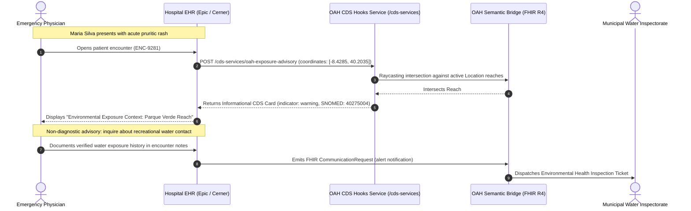

# Technical Architecture & Informatics Specification
## OneAquaHealth Semantic Interoperability Bridge (OAH-Bridge)
**Standard:** HL7® FHIR® R4 (v4.0.1) & CDS Hooks 1.0  
**Domain:** Environmental Health Surveillance to Clinical Workflow Integration  

---

## 1. The 10 Invariable Semantic Principles

During architectural review against the official HL7 FHIR R4 standard, the following 10 semantic design principles were frozen into the OAH-Bridge engine:

### 1.1 Separation of Ascertainment Technique vs. Epistemic Status
- **Standard Requirement**: In FHIR R4, `Observation.method` is reserved for the physical or algorithmic ascertainment mechanism (how the measurement was collected or generated).
- **In OAH-Bridge**:
  - `Observation.method` is bound to `http://oneaquahealth.eu/fhir/cs/observation-technique` with codes:
    - `in-situ-sensor-probe` (multiparameter sonde telemetry)
    - `citizen-visual-observation` (geotagged field reports)
    - `predictive-model-inference` (DipteraCAST / algorithmic forecasting)
    - `laboratory-chemical-assay` (simulated reference-laboratory assay)
  - Epistemic validity is modeled via a formal extension `http://oneaquahealth.eu/fhir/StructureDefinition/oah-evidence-status` using `valueCodeableConcept` bound to `http://oneaquahealth.eu/fhir/cs/evidence-status` (`observed`, `inferred`, `confirmed`).

### 1.2 First-Class Evidence Support Metric
- Rather than hiding confidence scores in unindexed annotations, OAH-Bridge generates a standalone `Observation` resource representing the **Evidence Support Score**.
- It is linked to the primary hazard observation via `Observation.focus`.
- Its value is carried as `valueDecimal: 0.86`, with constituent corroboration components (sensor, citizen, temporal) represented in `Observation.component` with codes from `http://oneaquahealth.eu/fhir/cs/assessment-metrics`.

### 1.3 Reproducible Environmental Risk Assessment
- The generated `RiskAssessment` resource explicitly references:
  - `RiskAssessment.method` $\rightarrow$ `http://oneaquahealth.eu/fhir/cs/assessment-method#oah-environmental-exposure-assessment`
  - `RiskAssessment.basis` $\rightarrow$ References to the Hazard Observation and Evidence Score Observation.

### 1.4 Population-Level Risk & Definitional Cohort
- In FHIR R4, `RiskAssessment.subject` can be a `Patient`, `Group`, `Device`, or `Location`.
- To enable community-level exposure modeling without enumerating or tracking individuals, OAH-Bridge assigns `RiskAssessment.subject` to a **definitional cohort**:
  - Resource: `Group`
  - Attribute: `actual = false` (in FHIR R4, designates a definitional cohort whose members are identified by criteria rather than explicit enumeration)
  - Type: `person`
  - Characteristic: Geographic presence within the spatial exposure polygon during the active hazard temporal window.
- **Privacy-Preserving Cohort Representation**: Environmental surveillance resources contain zero individual patient identifiers. In FHIR R4, `Group` with `actual = false` designates a definitional exposure cohort where individual membership is not required for the environmental exposure definition. Encounter intersection evaluation occurs entirely within the healthcare provider's private EHR network via CDS Hooks, satisfying data minimization principles without asserting that `actual=false` alone constitutes legal GDPR compliance.

### 1.5 Strict Clinical Terminology Boundary (SNOMED CT)
- In FHIR R4, `RiskAssessment.condition` is defined as `Reference(Condition)`. This is invalid for unexposed or non-diagnosed populations because no patient condition record exists.
- Therefore, the predicted clinical disorder is serialized strictly in `RiskAssessment.prediction.outcome` as a verified active SNOMED CT `CodeableConcept` pinned to the official `SNOMED CT International Edition — March 2026 (20260301)`:
  - `40275004`: Preferred term: `Contact dermatitis` | Display label: `Contact dermatitis` (Coimbra Cyanobacteria)
  - `416113008`: Preferred term: `Disorder characterized by fever` | Display label: `Acute febrile illness` (Toulouse Diptera)
  - `69776003`: Preferred term: `Acute gastroenteritis` | Display label: `Acute gastroenteritis` (Figueira Enteropathogen Surge)
- All 3 concepts are active in the pinned release and documented in `conformance/terminology_manifest.json`, explicitly distinguishing terminology server preferred terms from scenario display labels.
- Likelihood is carried in `prediction.qualitativeRisk` bound to the HL7 `risk-probability` CodeSystem (`moderate`, `high`).

### 1.6 Decoupled Scientific vs. Workflow Artifacts
- The scientific knowledge graph (`Location`, `Observation`, `Group`, `RiskAssessment`, `Provenance`) is cleanly separated from operational workflow triggers (`Flag`, `CommunicationRequest`) and the CDS Hooks integration protocol.

### 1.7 Synthetic Demonstration Grounding
- All demonstration datasets are synthetic but strictly grounded in the real geographic boundaries and environmental research parameters of OneAquaHealth pilot cities:
  - **Coimbra, Portugal**: Mondego River Basin (Parque Verde Reach)
  - **Toulouse, France**: Garonne River Margin (Ramier Urban Reach)
  - **Lower Mondego / Figueira da Foz**: Estuarine Storm Surge & Enteropathogen Influx

### 1.8 Deterministic Corroboration Engine
- Demonstrates reproducible, transparent evidence fusion using fixed weights ($w_{sensor} = 0.40, w_{citizen} = 0.30, w_{temporal} = 0.30$) and calibrated threshold logic ($v0.1$).

### 1.9 Dual REST Query Capability
- Exposes standard FHIR R4 endpoints (`/api/fhir/Observation`, `/api/fhir/Location`, `/api/fhir/Group`, `/api/fhir/RiskAssessment`, `/api/fhir/Bundle`) alongside documented custom search parameters (`?oah-hazard=...`, `?oah-location=...`).

### 1.10 Multi-Tier Conformance Validation
- Automated 6-tier compliance test harness running 44 distinct programmatic assertions against JSON schema, profile constraints, code membership, external SNOMED CT ontologies, and reference graph integrity.

---

## 2. Mathematical Corroboration Model

The composite evidence support score $S \in [0.0, 1.0]$ is computed deterministically:

$$S = w_{sensor} \cdot C_{sensor} + w_{citizen} \cdot C_{citizen} + w_{temporal} \cdot C_{temporal}$$

Where:
- $w_{sensor} = 0.40$ (multiparameter probe calibration weight)
- $w_{citizen} = 0.30$ (geotagged citizen consensus weight)
- $w_{temporal} = 0.30$ (persistence over sliding 6-hour window)

### Epistemic Transition State Machine
```
   [ Raw Field Data ]
           │
           ▼
    S < 0.40  ─────────►  epistemic-status = "observed" (Sub-threshold / Watchlist)
           │
    0.40 ≤ S < 0.70  ──►  epistemic-status = "inferred" (Moderate Advisory)
           │
    0.70 ≤ S ≤ 1.00  ──►  epistemic-status = "inferred" (High Clinical Warning)
           │
  [ Wet-Lab HPLC Assay ]
           │
           ▼
     Positive Lab Assay  ─►  epistemic-status = "confirmed" (Definitive Public Health Order)
```

---

## 3. FHIR R4 Resource Composition Matrix

| Resource | Profile ID | Primary Semantic Purpose |
| :--- | :--- | :--- |
| **Location** | `oah-exposure-location` | GeoJSON polygon boundary of the contaminated river reach. |
| **Observation** (Hazard) | `oah-hazard-observation` | Target biological hazard, method code, and epistemic extension. |
| **Observation** (Score) | `oah-evidence-support` | Quantitative corroboration score (0.86) and subcomponent metrics. |
| **Group** | `oah-exposure-group` | Definitional population cohort (`actual = false`) within the spatial buffer. |
| **RiskAssessment** | `oah-risk-assessment` | Evaluates exposure probability and links to SNOMED CT clinical outcome. |
| **Provenance** | `Provenance` | Cryptographic audit trail of data collectors, software, and timestamp. |
| **Flag** | `Flag` | Operational active alert banner for hospital EHR integration. |
| **CommunicationRequest** | `CommunicationRequest` | Automated dispatch ticket to municipal health and environmental authorities. |

---

## 4. CDS Hooks 1.0 Clinical Workflow


