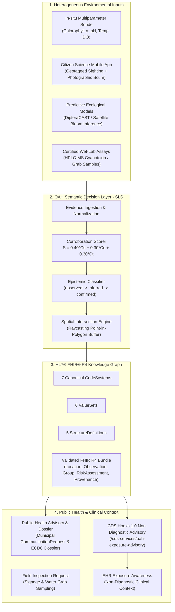

# OneAquaHealth Semantic Interoperability Bridge (OAH-Bridge)

[](http://oneaquahealth.eu)
[-firebrick.svg)](conformance/)
[](api/server.py)
[-success.svg)](tests/)
[](validator/)
[-teal.svg)](#-definitional-cohorts--privacy-architecture)

> **Official Demonstration for OneAquaHealth Hackathon — Track 7: Standards & Interoperability**  
> *Connecting environmental surveillance (sensors, citizen science, AI models) with hospital clinical awareness (HL7® FHIR® R4, CDS Hooks 1.0, SNOMED CT) to protect community health.*
>
> ⚠️ **DEMONSTRATION DATA NOTICE**: *Synthetic demonstration scenarios grounded in OneAquaHealth research-city geography (Coimbra, Toulouse, Figueira da Foz). Not live public-health surveillance.*

---

## ⚡ Executive Summary

Urban aquatic ecosystems are increasingly monitored by high-tech sensors, citizen scientists, and AI models. Yet, **when an environmental pathogen strikes, hospital emergency rooms are completely blind to it.**

A child swims in an active river bloom, presents to the ER with acute dermatitis, and the clinician evaluates ordinary atopic dermatitis or allergies without knowing about local toxic water conditions.

**OAH-Bridge** is a semantic interoperability layer that transforms multi-source environmental evidence into provenance-aware, spatially contextualized FHIR R4 health signals. Its Semantic Decision Layer explicitly represents evidence status, corroboration, exposure pathways and potentially exposed populations before connecting them to standardized clinical concepts and non-diagnostic public-health workflows:
1. **Multi-Source Evidence**: Ingests heterogeneous environmental inputs (in-situ sondes, citizen science reports, predictive models, certified wet-lab assays).
2. **Deterministic Corroboration**: Computes a transparent composite score ($S = 0.40 C_s + 0.30 C_c + 0.30 C_t$) and assigns a formal **epistemic status** (`observed`, `inferred`, `confirmed`).
3. **Spatial Exposure Geometry**: Projects GIS buffer boundaries into a definitional cohort via **FHIR `Group (actual = false)`**; individual membership is not required for the environmental exposure definition.
4. **Health Risk Context**: Evaluates population exposure risk via **FHIR `RiskAssessment`** with verified active SNOMED CT concepts and HL7 `risk-probability`.
5. **Standards-Based Workflows**: Emits validated **HL7® FHIR® R4 Bundles** with Provenance, dispatches municipal public health notices (`CommunicationRequest`), and surfaces informational **CDS Hooks 1.0** context cards (`patient-view`) during EHR triage (no diagnosis or treatment recommendation).

---

## 🏛️ System Architecture



---

## 🎯 Track 7 Standards Conformance Matrix

| Standard / Component | Implementation in OAH-Bridge | Conformance Rationale & File Reference |
| :--- | :--- | :--- |
| **HL7® FHIR® R4** | `4.0.1` Resource Serialization | Complete JSON schema compliance across 8 distinct resources in [`engine/composer.py`](engine/composer.py). |
| **Observation.method** | Strictly Ascertainment Technique | Bound to [`conformance/cs-observation-technique.json`](conformance/cs-observation-technique.json) (`in-situ-sensor-probe`, `citizen-visual-observation`). Epistemic status is NOT conflated. |
| **Epistemic Extension** | `oah-evidence-status` | Standalone extension with `valueCodeableConcept` bound to [`conformance/cs-evidence-status.json`](conformance/cs-evidence-status.json) (`observed`, `inferred`, `confirmed`). |
| **Evidence Metric** | Standalone `Observation` | First-class metric observation linked via `Observation.focus` containing subcomponent telemetry in `Observation.component`. |
| **Definitional Population** | Definitional `Group (actual = false)` | In FHIR R4, `actual = false` designates a definitional exposure cohort; individual membership is not required for the environmental exposure definition. Privacy-preserving cohort representation. |
| **Clinical Disorder Outcome**| `RiskAssessment.prediction.outcome` | Pinned `SNOMED CT International Edition — March 2026 (20260301)` concepts (`40275004`, `416113008`, `69776003`) placed in prediction outcome, distinguishing preferred term from display label. |
| **CDS Hooks 1.0** | Published STU 1.0 Specification | `patient-view` implementation providing informational environmental exposure context; no diagnosis or treatment recommendation. |
| **External Ontologies** | SNOMED CT & HL7 Standard | Integrated with 3/3 active SNOMED CT concepts pinned to `SNOMED CT International Edition — March 2026 (20260301)`, formal Terminology Manifest (`/api/terminology`), and HL7 `risk-probability`. |

---

## 🚀 Quickstart & Reproduction

### 1. Prerequisites
- Python 3.10+
- Modern Web Browser (Chrome, Firefox, Edge, Safari)

### 2. Run the Server
```bash
# Clone the repository
git clone https://github.com/rasmiya06/OneAquaHealth-Bridge.git
cd OneAquaHealth-Bridge

# Start the REST API & CDS Hooks Reference Server
python3 api/server.py 8000
```
Open your browser to: **`http://localhost:8000`**

### 3. Run the Automated Test Suite
```bash
# Run all 25 unit and integration tests
pytest
```
*Result: 25 passed in ~1.03s (100% Pass Rate).*

---

## 🔒 Definitional Cohorts & Privacy Architecture

- **FHIR Group (actual = false)**: Definitional exposure cohort; individual membership is not required for the environmental exposure definition.
- **Privacy-Preserving Cohort Representation**: No patient identifiers, clinical records, or personal locations are ever ingested or transmitted by environmental monitoring systems.
- **Private Network Execution**: Clinical encounter location evaluation occurs entirely **inside the hospital's private EHR network** when a patient encounter triggers the CDS Hook (`patient-view`). Zero personal health data leaves the hospital firewall.
- **Data Minimization by Design**: Aligns with privacy-by-design principles through data minimization, avoiding any tracking of individuals.

---

*Synthetic demonstration data grounded in OneAquaHealth research-city geography. HL7® and FHIR® are registered trademarks of Health Level Seven International.*
