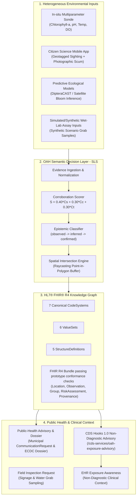

# OneAquaHealth Semantic Interoperability Bridge (OAH-Bridge)

[](http://oneaquahealth.eu)
[-firebrick.svg)](conformance/)
[-darkgreen.svg)](api/server.py)
[-navy.svg)](conformance/terminology_manifest.json)
[-success.svg)](tests/)
[](validator/)
[-teal.svg)](#-definitional-cohorts--privacy-architecture)
[](LICENSE)

> **Official Submission for OneAquaHealth Hackathon — Track 7: Standards & Interoperability**  
> *Bridging environmental aquatic surveillance (sensors, citizen science, ecological models) with hospital clinical awareness (HL7® FHIR® R4, CDS Hooks 1.0, SNOMED CT) to protect European community health.*
>
> ⚠️ **DEMONSTRATION NOTICE**: *Grounded in real OneAquaHealth research-city geography (Coimbra, Toulouse, Figueira da Foz) using calibrated synthetic demonstration scenarios. Not live medical surveillance.*

---

## 📑 Table of Contents
- [Executive Summary](#-executive-summary)
- [Relationship to Upstream OneAquaHealth FHIR IG](#-relationship-to-upstream-oneaquahealth-fhir-implementation-guide)
- [System Architecture](#-system-architecture)
- [Multi-City Demonstration Matrix](#-multi-city-demonstration-matrix)
- [The 7-Step Semantic Decision Chain](#-the-7-step-semantic-decision-chain)
- [Track 7 Standards Conformance Matrix](#-track-7-standards-conformance-matrix)
- [Definitional Cohorts & Privacy Architecture](#-definitional-cohorts--privacy-architecture)
- [Verification & Automated Test Suite](#-verification--automated-test-suite)
- [Quickstart & Reproduction](#-quickstart--reproduction)
- [Repository File Layout](#-repository-file-layout)
- [License & Open Source](#-license)

---

## ⚡ Executive Summary

Urban aquatic ecosystems are increasingly monitored by in-situ water sondes, citizen science mobile apps, and predictive ecological models. However, environmental surveillance streams and clinical encounter workflows typically operate in separate silos without real-time semantic linkage.

In our motivating demonstration scenario, an individual who swims or kayaks in an active river bloom presents to an emergency encounter with acute dermatitis. Without environmental exposure context, clinicians evaluate symptoms without visibility into localized toxic water conditions.

**OAH-Bridge** is an **operational Semantic Decision Layer (SLS)** that transforms multi-source environmental evidence into provenance-aware, spatially contextualized FHIR R4 health signals:
1. **Multi-Source Evidence**: Ingests heterogeneous environmental inputs (in-situ sondes, citizen science reports, predictive models, simulated/synthetic wet-lab assay inputs).
2. **Deterministic Corroboration**: Computes a transparent composite score ($S = 0.40 C_s + 0.30 C_c + 0.30 C_t$) and assigns a formal **epistemic status** (`observed`, `inferred`, `confirmed`).
3. **Spatial Exposure Geometry**: Projects GIS buffer boundaries into a definitional cohort via **FHIR `Group (actual = false)`**; individual membership is not required for the environmental exposure definition.
4. **Health Risk Context**: Evaluates population exposure risk via **FHIR `RiskAssessment`** with verified active SNOMED CT concepts and HL7 `risk-probability`.
5. **Standards-Based Workflows**: Emits **FHIR R4 Bundles passing prototype conformance checks** with Provenance, dispatches municipal public health notices (`CommunicationRequest`), and surfaces informational **CDS Hooks 1.0** context cards (`patient-view`) during EHR triage (no diagnosis or treatment recommendation).

---

## 🌐 Relationship to Upstream OneAquaHealth FHIR Implementation Guide

The official [OneAquaHealth project](https://oneaquahealth.eu) maintains foundational work on an [HL7 Europe OneAquaHealth FHIR Implementation Guide (`hl7-eu/oah`)](https://github.com/hl7-eu/oah).

**OAH-Bridge does not claim to reinvent foundational FHIR IG profiles.** Instead, OAH-Bridge's core scientific contribution is an **operational Semantic Decision Layer (SLS)** that bridges the gap between raw surveillance streams and standard health records:
- Ingests multi-source, noisy environmental observations (sensors, citizen science, predictive models, simulated laboratory inputs).
- Evaluates epistemic certainty and mathematical corroboration transparently ($S = 0.40 C_s + 0.30 C_c + 0.30 C_t$).
- Establishes spatial exposure geometry and projects it onto definitional population cohorts (`Group (actual = false)`).
- Connects environmental hazard context into clinical EHR triage via **CDS Hooks 1.0 (`patient-view`)** without diagnostic or treatment overreach.

---

## 🏛️ System Architecture



---

## 🗺️ Multi-City Demonstration Matrix

The platform is calibrated across three real OneAquaHealth European research cities:

| City & Water Basin | Target Hazard | Key Telemetry Inputs | Epistemic Status & Score | Exposed Cohort | Clinical Outcome Context (SNOMED CT Pinned 20260301) |
| :--- | :--- | :--- | :--- | :--- | :--- |
| **🇵🇹 Coimbra**<br>*(Mondego River Basin)* | Cyanobacteria / Microcystin Toxic Surge | Chlorophyll-a: 48.2 µg/L<br>Microcystin-LR: 18.4 µg/L<br>Water Temp: 24.8 °C | **Confirmed Assertion (Lab Override)**<br>Score: `0.86` ($C_s=0.90, C_c=0.75, C_t=0.92$) | ~1,850 swimmers (`Group actual=false`) | `40275004` \| Contact dermatitis |
| **🇫🇷 Toulouse**<br>*(Garonne Urban Reach)* | Diptera Vector Proliferation Surge | Larval Density: 34 / dip<br>Stagnation Ratio: 0.82<br>Canopy Cover: 65% | **Modeled Inference**<br>Score: `0.82` ($C_s=0.90, C_c=0.67, C_t=0.85$) | ~3,200 park visitors (`Group actual=false`) | `416113008` \| Disorder characterized by fever<br>*(Display: Acute febrile illness)* |
| **🇵🇹 Figueira da Foz**<br>*(Mondego Lower Estuary)* | Post-Storm Enteropathogen Contamination | E. coli Assay: 2,400 CFU/100mL<br>Turbidity: 85.0 NTU<br>Conductivity: 650 µS/cm | **Confirmed Assertion (Lab Override)**<br>Score: `0.84` ($C_s=1.00, C_c=0.62, C_t=0.85$) | ~950 estuary bathers (`Group actual=false`) | `69776003` \| Acute gastroenteritis |

---

## 🔬 The 7-Step Semantic Decision Chain

The interactive web console features a **`▶ GUIDED WALKTHROUGH`** button enabling judges to step through the sequence:

1. **Evidence Ingestion**: Ingests multi-parameter probe telemetry and geotagged citizen observations.
2. **Deterministic Corroboration**: Calculates composite score $S = 0.40 C_s + 0.30 C_c + 0.30 C_t$ from raw inputs and transitions epistemic status (`observed` $\rightarrow$ `inferred` $\rightarrow$ `confirmed`).
3. **Spatial Exposure Geometry**: Projects satellite coordinates into a 600m river reach buffer polygon using raycasting point-in-polygon analysis.
4. **Definitional Cohort**: Encapsulates exposed population into **FHIR `Group (actual = false)`**—ensuring data minimization and privacy.
5. **RiskAssessment & SNOMED CT**: Maps population exposure probability to pinned `SNOMED CT International Edition (20260301)` clinical outcome concepts.
6. **FHIR R4 Knowledge Graph**: Assembles a pure 8-resource HL7 FHIR R4 Bundle with cryptographic `Provenance`.
7. **Actionable Distribution**: Emits municipal `CommunicationRequest` and serves real-time **CDS Hooks 1.0 (`patient-view`)** cards during hospital EHR encounter triage.

---

## 🎯 Track 7 Standards Conformance Matrix

| Standard / Component | Implementation in OAH-Bridge | Conformance Rationale & File Reference |
| :--- | :--- | :--- |
| **HL7® FHIR® R4** | Automated prototype FHIR R4 conformance assertions | Prototype implementation with 44 automated structural assertions across 8 distinct resources in [`engine/composer.py`](engine/composer.py). |
| **Observation.method** | Strictly Ascertainment Technique | Bound to [`conformance/cs-observation-technique.json`](conformance/cs-observation-technique.json) (`in-situ-sensor-probe`, `citizen-visual-observation`). Epistemic status is NOT conflated. |
| **Epistemic Extension** | `oah-evidence-status` | Standalone extension with `valueCodeableConcept` bound to [`conformance/cs-evidence-status.json`](conformance/cs-evidence-status.json) (`observed`, `inferred`, `confirmed`). |
| **Evidence Metric** | Standalone `Observation` | First-class metric observation linked via `Observation.focus` containing subcomponent telemetry in `Observation.component`. |
| **Definitional Population** | Definitional `Group (actual = false)` | In FHIR R4, `actual = false` designates a definitional exposure cohort; individual membership is not required for the environmental exposure definition. Privacy-preserving cohort representation. |
| **Clinical Disorder Outcome**| `RiskAssessment.prediction.outcome` | Pinned `SNOMED CT International Edition — March 2026 (20260301)` concepts (`40275004`, `416113008`, `69776003`) placed in prediction outcome, distinguishing preferred term from display label. |
| **CDS Hooks 1.0** | Published STU 1.0 Specification | `patient-view` implementation providing informational environmental exposure context; no diagnosis or treatment recommendation. |
| **External Ontologies** | SNOMED CT & HL7 Standard | Integrated with 3/3 active SNOMED CT concepts pinned to `SNOMED CT International Edition — March 2026 (20260301)`, formal Terminology Manifest (`/api/terminology`), and HL7 `risk-probability`. |

---

## 🔒 Definitional Cohorts & Privacy Architecture

- **FHIR Group (actual = false)**: Definitional exposure cohort; individual membership is not required for the environmental exposure definition.
- **Privacy-Preserving Cohort Representation**: No patient identifiers, clinical records, or personal GPS tracking are ever ingested or transmitted by environmental monitoring systems.
- **Private Network Execution**: Clinical encounter location evaluation occurs entirely **inside the hospital's private EHR network** when a patient encounter triggers the CDS Hook (`patient-view`). Zero personal health data leaves the hospital firewall.
- **Data Minimization by Design**: Aligns with privacy-by-design principles through data minimization, avoiding any tracking of individuals.

---

## 🧪 Verification & Automated Test Suite

The repository contains a two-layer verification suite:
1. **Pytest Unit & Integration Test Suite** (`25/25 PASS` in ~1.03s):
   - Verifies API endpoints, CDS Hooks discovery, point-in-polygon raycasting, evidence sub-score calibration, lab overrides, and terminology manifest resolution.
2. **Self-Hosted 6-Tier Prototype Conformance Harness** (`44/44 PASS`):
   - Programmatically verifies structural element constraints, custom profiles, canonical CodeSystem membership, SNOMED CT bindings, reference graph integrity, and formula invariants.

```bash
$ pytest
============================= test session starts ==============================
platform linux -- Python 3.12.3, pytest-7.4.4, pluggy-1.4.0
rootdir: /home/yusuf/Desktop/aqua, configfile: pytest.ini
collected 25 items

tests/test_api_endpoints.py::test_capability_statement_endpoint PASSED   [  4%]
tests/test_api_endpoints.py::test_fhir_observation_search PASSED         [  8%]
tests/test_api_endpoints.py::test_fhir_risk_assessment_endpoint PASSED   [ 12%]
tests/test_api_endpoints.py::test_fhir_bundle_endpoint PASSED            [ 16%]
tests/test_api_endpoints.py::test_cds_hooks_discovery PASSED             [ 20%]
tests/test_api_endpoints.py::test_cds_hooks_execution_intersection PASSED [ 24%]
tests/test_api_endpoints.py::test_cds_hooks_execution_outside_zone PASSED [ 28%]
tests/test_api_endpoints.py::test_demo_run_judge_mode PASSED             [ 32%]
tests/test_api_endpoints.py::test_conformance_endpoint PASSED            [ 36%]
tests/test_cds_hooks.py::test_cds_service_exposure_intersection PASSED   [ 40%]
tests/test_cds_hooks.py::test_cds_service_outside_exposure_zone PASSED   [ 44%]
tests/test_composer.py::test_bundle_composition_resource_types PASSED    [ 48%]
tests/test_composer.py::test_hazard_observation_semantics PASSED         [ 52%]
tests/test_composer.py::test_evidence_support_observation_semantics PASSED [ 56%]
tests/test_composer.py::test_risk_assessment_semantics PASSED            [ 60%]
tests/test_scoring.py::test_fixed_weights_sum_to_one PASSED              [ 64%]
tests/test_scoring.py::test_coimbra_score_calibration PASSED             [ 68%]
tests/test_scoring.py::test_laboratory_confirmation_override PASSED      [ 72%]
tests/test_scoring.py::test_low_score_epistemic_classification PASSED    [ 76%]
tests/test_spatial.py::test_point_in_polygon_inside_and_outside PASSED   [ 80%]
tests/test_spatial.py::test_coimbra_patient_exposure_intersection PASSED [ 84%]
tests/test_spatial.py::test_definitional_cohort_characteristics_structure PASSED [ 88%]
tests/test_validation_pipeline.py::test_validation_all_scenarios_pass PASSED [ 92%]
tests/test_validation_pipeline.py::test_validator_detects_illegal_risk_condition PASSED [ 96%]
tests/test_validation_pipeline.py::test_snomed_ct_terminology_manifest_resolution PASSED [100%]

============================== 25 passed in 1.03s ==============================
```

---

## 🚀 Quickstart & Reproduction

### 1. Prerequisites
- Python 3.10+
- Modern Web Browser (Chrome, Firefox, Edge, Safari)

### 2. Run the Server
```bash
# Clone the repository
git clone https://github.com/rasmiya06/OneAquaHealth-Bridge.git
cd OneAquaHealth-Bridge

# Start the REST API & CDS Hooks Reference Server
python3 api/server.py 8000
```
Open your browser to: **`http://localhost:8000`**

### 3. Run the Automated Test Suite
```bash
pytest
```

### 🔗 Reference REST & CDS Endpoints

| Endpoint | Method | Semantic Function |
| :--- | :--- | :--- |
| `GET /api/demo/run?scenario=coimbra-cyanobacteria` | `GET` | Executes full SLS pipeline and returns FHIR Bundle + validation report |
| `GET /api/fhir/metadata` | `GET` | FHIR R4 CapabilityStatement |
| `GET /cds-services` | `GET` | CDS Hooks 1.0 discovery endpoint |
| `POST /cds-services/oah-exposure-advisory` | `POST` | CDS Hooks 1.0 patient-view execution endpoint |
| `GET /api/terminology` | `GET` | Pinned SNOMED CT (20260301) manifest |
| `GET /api/conformance` | `GET` | 6-tier validation suite output (44/44 checks) |

---

## 📁 Repository File Layout

```text
OneAquaHealth-Bridge/
├── api/
│   └── server.py                   # REST FHIR R4 endpoints & CDS Hooks 1.0 reference server
├── conformance/
│   ├── codesystems/                # 7 canonical CodeSystems (evidence-status, technique, metrics)
│   ├── valuesets/                  # 6 ValueSets
│   ├── structuredefinitions/       # 5 FHIR R4 profiles & custom extensions
│   ├── terminology_manifest.json   # Pinned SNOMED CT 20260301 concept resolution
│   └── capability_statement.json   # FHIR R4 CapabilityStatement (v0.1-prototype)
├── engine/
│   ├── models.py                   # Domain models & telemetry dataclasses
│   ├── scenarios.py                # 3 research city pilot scenarios (Coimbra, Toulouse, Figueira)
│   ├── scoring.py                  # Dynamic corroboration scoring (Cs, Cc, Ct) & epistemic logic
│   ├── spatial.py                  # Point-in-polygon raycasting & GIS buffer intersection
│   └── composer.py                 # Pure FHIR R4 8-resource Bundle constructor
├── tests/                          # 25 automated pytest unit and integration tests
├── validator/
│   └── fhir_validator.py           # 6-tier prototype conformance assertion harness (44 checks)
├── web/
│   ├── index.html                  # Interactive decision console, FHIR graph & guided walkthrough
│   ├── app.js                      # Client state, dynamic SLS updater & CDS trigger logic
│   └── styles.css                  # UI styling and visual feedback components
├── ARCHITECTURE.md                 # System architecture, epistemic transitions, CDS sequence
├── PITCH_SCRIPT.md                 # 5-minute video presentation script & Judge Q&A guide
├── LICENSE                         # MIT Open Source License
└── README.md                       # Comprehensive project documentation
```

---

## 📜 License

This project is licensed under the [MIT License](LICENSE) — free and open-source for community health innovation.

*Synthetic demonstration data grounded in OneAquaHealth research-city geography. HL7® and FHIR® are registered trademarks of Health Level Seven International. SNOMED CT® is a registered trademark of SNOMED International.*
